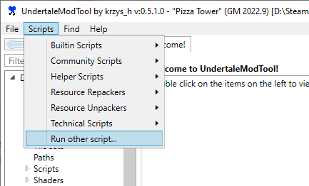
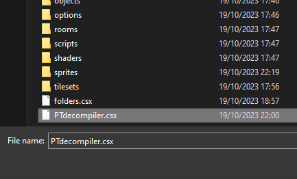
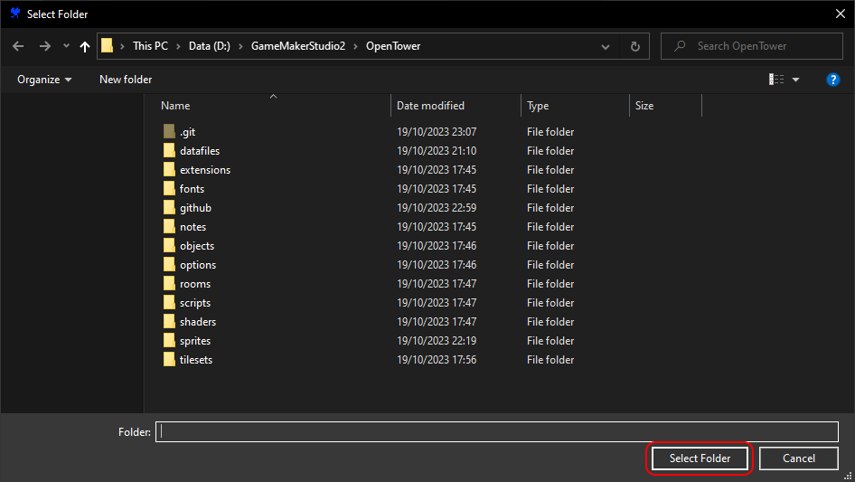

# OpenTower
A mostly accurate Pizza Tower decompilation, without any optimizations or unused stuff removed. 
Meant for more experienced people who prefer modding without the code holding their hand.

# Attribution
OpenTower is licensed under [CC BY 4.0](https://creativecommons.org/licenses/by/4.0/). 
You can do anything with this project as long as I'm credited.

# Requirements
- [Pizza Tower on Steam](https://store.steampowered.com/app/2231450/Pizza_Tower/) *the Switch version is compiled different and won't work.*
- [GameMaker 2023.1.1.62](https://gms.yoyogames.com/GameMaker-Installer-2023.1.1.62.exe) *other versions will bring bugs.* 
- [Steamworks SDK v1.55](https://partner.steamgames.com/downloads/steamworks_sdk_155.zip) *unless you're planning to remove it.*
- [UndertaleModTool](https://github.com/UnderminersTeam/UndertaleModTool/releases/tag/0.8.4.1)
- A reasonable amount of experience with what is known as a "Computer"

This repository doesn't include any datafiles, sprites or sounds because piracy is big nonos and I'd prefer to avoid getting whooped by TDP. 
Because of that, now you'll have to do a whole annoying slow setup to get this thing working:

# Installation
1. Download OpenTower and every requirement above. Extract each thing where you'll want to keep them. 

2. Make sure Pizza Tower is up to date, with no mods. If you have `.po` files around, then you probably have a mod installed.

3. Open the `data.win` file in the game's folder with [UndertaleModTool](https://github.com/UnderminersTeam/UndertaleModTool/releases/tag/0.8.4.1).

4. Open the "Scripts" tab at the top of the UndertaleModTool window and select "Run other script..."

5. Go to OpenTower's folder and select the `PTdecompiler.csx` file. If it has a weird error, try the specified [UndertaleModTool](https://github.com/UnderminersTeam/UndertaleModTool/releases/tag/0.8.4.1) version.

6. It will ask you to select a folder. Select the root OpenTower folder. It should have all of these folders inside of it:

7. Wait. It takes a while to dump every frame of every sprite. Don't panic.
8. The decompilation is now ready to open in [GameMaker](https://gms.yoyogames.com/GameMaker-Installer-2023.1.1.62.exe). The project file to open is `PizzaTower_GM2.yyp`.
9. When the project is open, look for `Extensions > Steamworks` and change the SDK location setting to the [Steamworks SDK](https://partner.steamgames.com/downloads/steamworks_sdk_155.zip) folder.

**If you don't remove Steamworks before making a build, *it'll just run the game on Steam instead, unmodified.*** 
I recommend removing the extension entirely for standalone mods. Look through all Steam related code and comment out any use of the `steam_` functions.

# Issues
### Empty GameMaker
Delete the `%programdata%/GameMakerStudio2` folder while GameMaker is closed. Then reopen it. 
It happens when you use a newer GameMaker version. It breaks this older one.

### ImageMagick error when opening .csx
You have a very old UndertaleModTool version. Try [this stable version](https://github.com/UnderminersTeam/UndertaleModTool/releases/tag/0.8.4.1).

### Please update this
Well, I don't

# Upgrading GameMaker

*Not recommended for inexperienced programmers.* 
 
If you want to move to a future GameMaker version you'll need to make some changes.

1. Upgrade or remove the [Steamworks extension](https://github.com/YoYoGames/GMEXT-Steamworks/releases).
2. New GameMaker versions re-order and move assets around, making the code run in a different order. ***This breaks everything.*** The way I fix it is I make a persistent object that manually runs each broken object's step events in the intended order. Sounds terrible and tedious but if you really hate old GameMaker then you must.
3. The specific version of GameMaker used for Pizza Tower had a bug that you now have to replicate. Whenever text is drawn to the screen, offset it by the current font's sprite origin.
4. Rename the `string_split` script and function names to something else.
5. If your mod is going to be a patch rather than standalone, keep in mind that a patch for the .exe will have to be included alongside the .win patch.
6. Probably more. I forgot. Sorry?
